## Table of Contents
1. [System Architecture Overview](#1-system-architecture-overview)
2. [AI Agent Interaction Flow](#2-ai-agent-interaction-flow)
3. [Data Flow Architecture](#3-data-flow-architecture)
4. [Compliance Validation Flow](#4-compliance-validation-flow)
5. [Complete Onboarding Workflow](#5-complete-onboarding-workflow)
6. [Deployment Architecture](#6-deployment-architecture)
7. [High Availability & Disaster Recovery](#7-high-availability--disaster-recovery)
8. [Monitoring & Observability Architecture](#8-monitoring--observability-architecture)
9. [Security & Compliance Framework](#9-security--compliance-framework)
10. [AI Agent Decision Tree](#10-ai-agent-decision-tree)
11. [Database Entity Relationship Diagram](#11-database-entity-relationship-diagram)
12. [Performance & Scaling Strategy](#12-performance--scaling-strategy)
13. [DevOps & CI/CD Pipeline](#13-devops--cicd-pipeline)
14. [Cost Optimization Strategy](#14-cost-optimization-strategy)
15. [Business Impact & ROI Model](#15-business-impact--roi-model)
16. [Implementation Roadmap](#16-implementation-roadmap)
17. [Risk Assessment & Mitigation](#17-risk-assessment--mitigation)
18. [Success Metrics & KPIs](#18-success-metrics--kpis)

---

## 1. System Architecture Overview

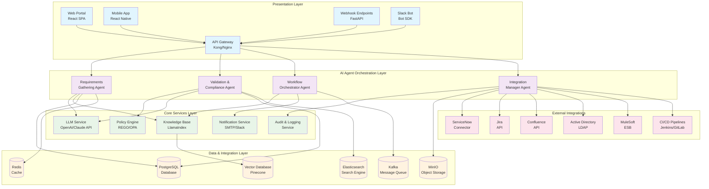

## 2. AI Agent Interaction Flow

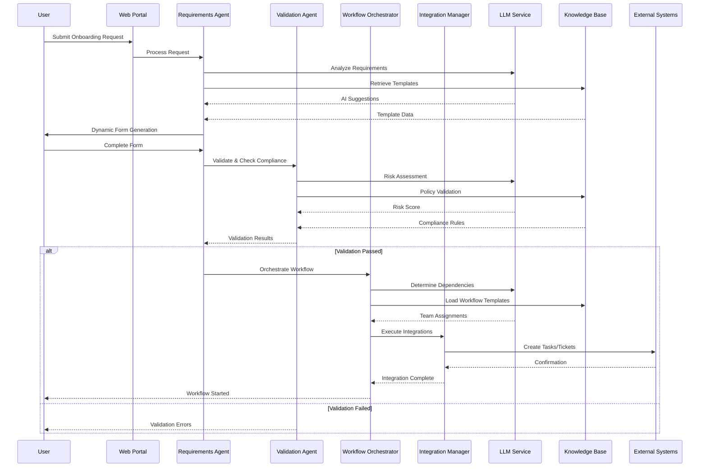

## 3. Data Flow Architecture

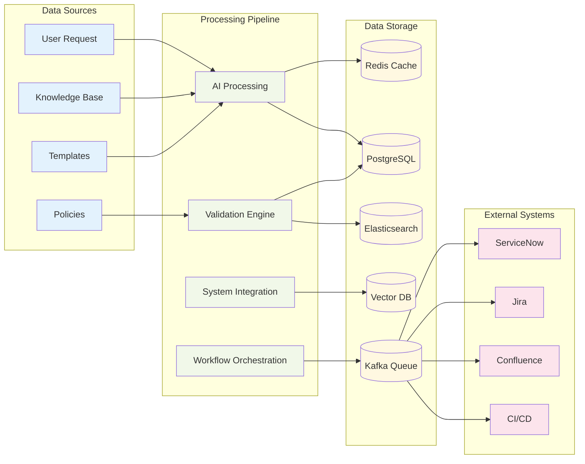

## 4. Compliance Validation Flow

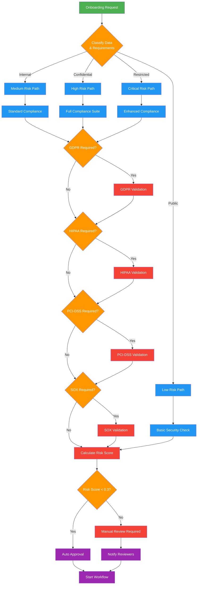

## 5. Complete Onboarding Workflow

```mermaid
flowchart TD
    START([User Initiates<br/>Onboarding Request]) --> LOGIN{User<br/>Authentication}
    
    LOGIN -->|Success| COLLECT[Collect Initial<br/>Requirements]
    LOGIN -->|Failed| AUTH_ERROR[Authentication Error]
    AUTH_ERROR --> END_FAIL([End - Failed])
    
    COLLECT --> AI_ANALYZE[AI Analysis<br/>Requirements Gathering Agent]
    AI_ANALYZE --> DYNAMIC_FORM[Generate Dynamic<br/>Questionnaire]
    DYNAMIC_FORM --> USER_INPUT[User Completes<br/>Detailed Form]
    
    USER_INPUT --> VALIDATE[Validation &<br/>Compliance Agent]
    VALIDATE --> RISK_ASSESS{Risk Assessment<br/>& Compliance Check}
    
    RISK_ASSESS -->|Low Risk<br/>Score < 0.3| AUTO_APPROVE[Automatic<br/>Approval]
    RISK_ASSESS -->|Medium Risk<br/>0.3 ≤ Score < 0.7| REVIEW_QUEUE[Manual Review<br/>Queue]
    RISK_ASSESS -->|High Risk<br/>Score ≥ 0.7| ENHANCED_REVIEW[Enhanced Security<br/>Review Required]
    
    AUTO_APPROVE --> ORCHESTRATE[Workflow Orchestrator<br/>Agent]
    
    REVIEW_QUEUE --> REVIEWER{Reviewer<br/>Available?}
    REVIEWER -->|Yes| MANUAL_REVIEW[Manual Review<br/>Process]
    REVIEWER -->|No| QUEUE_WAIT[Wait in Queue<br/>Send Notification]
    QUEUE_WAIT --> REVIEWER
    
    ENHANCED_REVIEW --> SECURITY_TEAM[Security Team<br/>Review]
    SECURITY_TEAM --> COMPLIANCE_TEAM[Compliance Team<br/>Review]
    COMPLIANCE_TEAM --> EXEC_APPROVAL{Executive<br/>Approval Required?}
    
    EXEC_APPROVAL -->|Yes| EXEC_REVIEW[Executive Review]
    EXEC_APPROVAL -->|No| APPROVED[Approved]
    EXEC_REVIEW --> APPROVED
    
    MANUAL_REVIEW --> DECISION{Review<br/>Decision}
    DECISION -->|Approved| APPROVED
    DECISION -->|Rejected| REJECTED[Application<br/>Rejected]
    DECISION -->|Needs Changes| FEEDBACK[Send Feedback<br/>to User]
    
    REJECTED --> NOTIFY_REJECT[Notify User<br/>of Rejection]
    NOTIFY_REJECT --> END_REJECT([End - Rejected])
    
    FEEDBACK --> USER_INPUT
    
    APPROVED --> ORCHESTRATE
    
    ORCHESTRATE --> TEAM_ASSIGN[AI-Powered<br/>Team Assignment]
    TEAM_ASSIGN --> PARALLEL_TASKS{Create Parallel<br/>Task Workflows}
    
    PARALLEL_TASKS --> SECURITY_TASKS[Security Team<br/>Tasks]
    PARALLEL_TASKS --> INFRA_TASKS[Infrastructure<br/>Tasks]
    PARALLEL_TASKS --> COMPLIANCE_TASKS[Compliance<br/>Tasks]
    PARALLEL_TASKS --> FINANCE_TASKS[Finance<br/>Approval Tasks]
    
    subgraph "Integration Manager Agent"
        SECURITY_TASKS --> CREATE_SNOW_SEC[Create ServiceNow<br/>Security Ticket]
        INFRA_TASKS --> CREATE_JIRA_INFRA[Create Jira<br/>Infrastructure Epic]
        COMPLIANCE_TASKS --> CREATE_COMPLIANCE[Create Compliance<br/>Checklist]
        FINANCE_TASKS --> CREATE_FINANCE[Create Finance<br/>Approval Request]
        
        CREATE_SNOW_SEC --> TRACK_SEC[Track Security<br/>Progress]
        CREATE_JIRA_INFRA --> TRACK_INFRA[Track Infrastructure<br/>Progress]
        CREATE_COMPLIANCE --> TRACK_COMP[Track Compliance<br/>Progress]
        CREATE_FINANCE --> TRACK_FIN[Track Finance<br/>Progress]
    end
    
    TRACK_SEC --> CONVERGENCE{All Tasks<br/>Complete?}
    TRACK_INFRA --> CONVERGENCE
    TRACK_COMP --> CONVERGENCE
    TRACK_FIN --> CONVERGENCE
    
    CONVERGENCE -->|No| MONITOR[Monitor Progress<br/>Send Updates]
    MONITOR --> CONVERGENCE
    
    CONVERGENCE -->|Yes| DEPLOY_READY[Ready for<br/>Deployment]
    
    DEPLOY_READY --> CI_CD[Trigger CI/CD<br/>Pipeline]
    CI_CD --> DEPLOY_SUCCESS{Deployment<br/>Successful?}
    
    DEPLOY_SUCCESS -->|Yes| POST_DEPLOY[Post-Deployment<br/>Validation]
    DEPLOY_SUCCESS -->|No| DEPLOY_FAIL[Deployment Failed<br/>Rollback]
    
    DEPLOY_FAIL --> NOTIFY_FAILURE[Notify Teams<br/>of Failure]
    NOTIFY_FAILURE --> INVESTIGATE[Investigation<br/>Required]
    INVESTIGATE --> REMEDIATE[Remediation<br/>Actions]
    REMEDIATE --> CI_CD
    
    POST_DEPLOY --> HEALTH_CHECK[Health Checks<br/>& Monitoring Setup]
    HEALTH_CHECK --> FINAL_VALIDATION{Final<br/>Validation Pass?}
    
    FINAL_VALIDATION -->|Yes| SUCCESS[Onboarding<br/>Complete]
    FINAL_VALIDATION -->|No| ROLLBACK[Rollback<br/>Required]
    
    SUCCESS --> NOTIFY_SUCCESS[Notify Stakeholders<br/>of Success]
    SUCCESS --> UPDATE_KNOWLEDGE[Update Knowledge<br/>Base]
    SUCCESS --> CLOSE_TICKETS[Close All<br/>Related Tickets]
    
    ROLLBACK --> NOTIFY_ROLLBACK[Notify Teams<br/>of Rollback]
    ROLLBACK --> INVESTIGATE
    
    NOTIFY_SUCCESS --> END_SUCCESS([End - Success])
    UPDATE_KNOWLEDGE --> END_SUCCESS
    CLOSE_TICKETS --> END_SUCCESS

    classDef start fill:#2ecc71,color:#fff
    classDef process fill:#3498db,color:#fff
    classDef decision fill:#f39c12,color:#fff
    classDef error fill:#e74c3c,color:#fff
    classDef success fill:#27ae60,color:#fff
    classDef end fill:#9b59b6,color:#fff

    class START,COLLECT,AI_ANALYZE,DYNAMIC_FORM,USER_INPUT start
    class VALIDATE,ORCHESTRATE,TEAM_ASSIGN,CREATE_SNOW_SEC,CREATE_JIRA_INFRA,CREATE_COMPLIANCE,CREATE_FINANCE,TRACK_SEC,TRACK_INFRA,TRACK_COMP,TRACK_FIN,DEPLOY_READY,CI_CD,POST_DEPLOY,HEALTH_CHECK process
    class LOGIN,RISK_ASSESS,REVIEWER,EXEC_APPROVAL,DECISION,PARALLEL_TASKS,CONVERGENCE,DEPLOY_SUCCESS,FINAL_VALIDATION decision
    class AUTH_ERROR,REJECTED,NOTIFY_REJECT,DEPLOY_FAIL,NOTIFY_FAILURE,INVESTIGATE,REMEDIATE,ROLLBACK,NOTIFY_ROLLBACK error
    class AUTO_APPROVE,APPROVED,SUCCESS,NOTIFY_SUCCESS,UPDATE_KNOWLEDGE,CLOSE_TICKETS success
    class END_FAIL,END_REJECT,END_SUCCESS end
```

## 6. Deployment Architecture

```mermaid
graph TB
    subgraph "Load Balancer"
        LB[Nginx Load Balancer<br/>:80, :443]
    end

    subgraph "Application Layer - Docker Containers"
        RGA1[Requirements Agent 1<br/>:8011]
        RGA2[Requirements Agent 2<br/>:8012]
        RGA3[Requirements Agent 3<br/>:8013]
        
        VCA1[Validation Agent 1<br/>:8021]
        VCA2[Validation Agent 2<br/>:8022]
        VCA3[Validation Agent 3<br/>:8023]
        
        WOA1[Orchestrator Agent 1<br/>:8031]
        WOA2[Orchestrator Agent 2<br/>:8032]
        
        IMA1[Integration Agent 1<br/>:8041]
        IMA2[Integration Agent 2<br/>:8042]
        
        LLM[LLM Service<br/>:8005]
        KB[Knowledge Service<br/>:8006]
    end

    subgraph "Data Layer"
        PG_PRIMARY[(PostgreSQL Primary<br/>:5432)]
        PG_REPLICA[(PostgreSQL Replica<br/>:5433)]
        
        REDIS_CLUSTER[Redis Cluster<br/>:7000-7002]
        
        ES_MASTER[(Elasticsearch Master<br/>:9200)]
        ES_DATA1[(Elasticsearch Data 1<br/>:9201)]
        ES_DATA2[(Elasticsearch Data 2<br/>:9202)]
        
        KAFKA[(Kafka<br/>:9092)]
        ZOOK[(Zookeeper<br/>:2181)]
        
        MINIO[(MinIO<br/>:9000)]
    end

    subgraph "Monitoring & Management"
        PROM[Prometheus<br/>:9090]
        GRAF[Grafana<br/>:3001]
        OPA[Policy Agent<br/>:8181]
        TEMPORAL[Temporal<br/>:7233]
    end

    %% Load Balancer Connections
    LB --> RGA1
    LB --> RGA2
    LB --> RGA3
    LB --> VCA1
    LB --> VCA2
    LB --> VCA3
    LB --> WOA1
    LB --> WOA2
    LB --> IMA1
    LB --> IMA2

    %% Service Dependencies
    RGA1 --> PG_PRIMARY
    RGA1 --> REDIS_CLUSTER
    RGA1 --> LLM
    RGA2 --> PG_REPLICA
    RGA2 --> REDIS_CLUSTER
    RGA3 --> PG_PRIMARY

    VCA1 --> PG_PRIMARY
    VCA1 --> ES_MASTER
    VCA1 --> OPA
    VCA2 --> PG_REPLICA
    VCA2 --> ES_DATA1

    WOA1 --> KAFKA
    WOA1 --> TEMPORAL
    WOA1 --> KB
    WOA2 --> KAFKA
    WOA2 --> TEMPORAL

    IMA1 --> MINIO
    IMA1 --> KAFKA
    IMA2 --> MINIO
    IMA2 --> KAFKA

    %% Database Replication
    PG_PRIMARY -.->|Replication| PG_REPLICA

    %% Elasticsearch Cluster
    ES_MASTER --- ES_DATA1
    ES_MASTER --- ES_DATA2

    %% Monitoring
    PROM --> RGA1
    PROM --> VCA1
    PROM --> WOA1
    PROM --> IMA1
    PROM --> PG_PRIMARY
    GRAF --> PROM

    %% Kafka Dependencies
    KAFKA --> ZOOK

    classDef lb fill:#ff6b6b,color:#fff
    classDef app fill:#4ecdc4,color:#fff
    classDef data fill:#45b7d1,color:#fff
    classDef monitor fill:#96ceb4,color:#fff

    class LB lb
    class RGA1,RGA2,RGA3,VCA1,VCA2,VCA3,WOA1,WOA2,IMA1,IMA2,LLM,KB app
    class PG_PRIMARY,PG_REPLICA,REDIS_CLUSTER,ES_MASTER,ES_DATA1,ES_DATA2,KAFKA,ZOOK,MINIO data
    class PROM,GRAF,OPA,TEMPORAL monitor
```

## 7. High Availability & Disaster Recovery

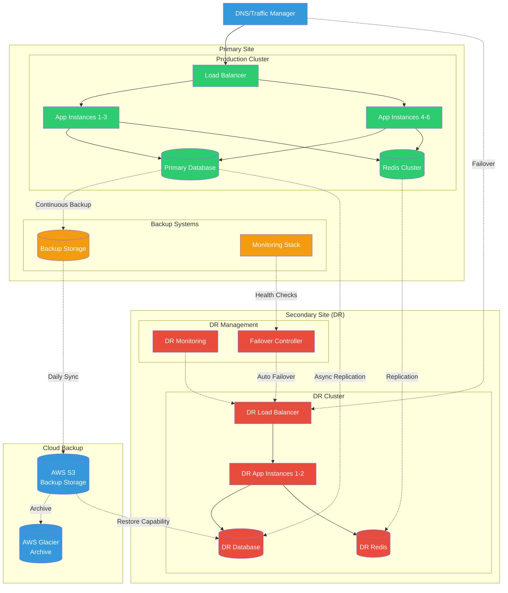

## 8. Monitoring & Observability Architecture

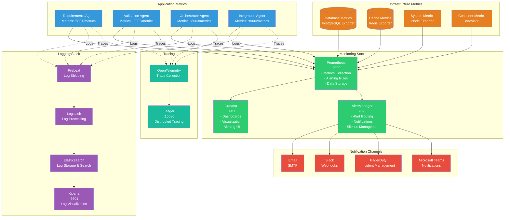

## 9. Security & Compliance Framework

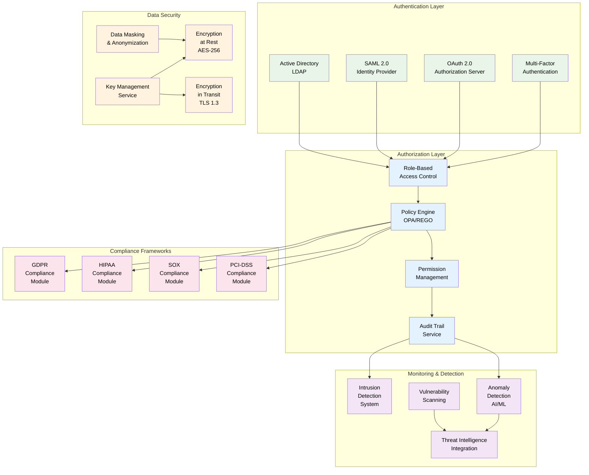

## 10. AI Agent Decision Tree

```mermaid
flowchart TD
    REQUEST[Onboarding Request<br/>Received] --> ANALYZE[AI Analysis of<br/>Request Content]
    
    ANALYZE --> APP_TYPE{Application<br/>Type?}
    
    APP_TYPE -->|Web Application| WEB_FLOW[Web App<br/>Requirements Flow]
    APP_TYPE -->|Mobile App| MOBILE_FLOW[Mobile App<br/>Requirements Flow]
    APP_TYPE -->|API Service| API_FLOW[API Service<br/>Requirements Flow]
    APP_TYPE -->|Microservice| MICRO_FLOW[Microservice<br/>Requirements Flow]
    APP_TYPE -->|Batch Process| BATCH_FLOW[Batch Process<br/>Requirements Flow]
    
    WEB_FLOW --> WEB_REQS[• Frontend Framework<br/>• Browser Compatibility<br/>• CDN Requirements<br/>• SSL/TLS Certificates]
    MOBILE_FLOW --> MOBILE_REQS[• Platform Support<br/>• App Store Guidelines<br/>• Push Notifications<br/>• Mobile Security]
    API_FLOW --> API_REQS[• API Documentation<br/>• Rate Limiting<br/>• Authentication Method<br/>• Versioning Strategy]
    MICRO_FLOW --> MICRO_REQS[• Container Registry<br/>• Service Mesh<br/>• Inter-service Communication<br/>• Circuit Breakers]
    BATCH_FLOW --> BATCH_REQS[• Scheduling System<br/>• Data Processing<br/>• Error Handling<br/>• Resource Allocation]
    
    WEB_REQS --> LOB_ANALYSIS
    MOBILE_REQS --> LOB_ANALYSIS
    API_REQS --> LOB_ANALYSIS
    MICRO_REQS --> LOB_ANALYSIS
    BATCH_REQS --> LOB_ANALYSIS
    
    LOB_ANALYSIS{Line of Business<br/>Analysis} --> RETAIL_BANKING
    LOB_ANALYSIS --> CORPORATE_BANKING
    LOB_ANALYSIS --> INSURANCE
    LOB_ANALYSIS --> WEALTH_MGMT
    LOB_ANALYSIS --> CAPITAL_MARKETS
    
    RETAIL_BANKING[Retail Banking<br/>• Customer Data Protection<br/>• PCI-DSS Compliance<br/>• High Availability<br/>• Multi-language Support] --> COMPLIANCE_CHECK
    
    CORPORATE_BANKING[Corporate Banking<br/>• Enterprise Integration<br/>• Transaction Processing<br/>• Audit Trails<br/>• Regulatory Reporting] --> COMPLIANCE_CHECK
    
    INSURANCE[Insurance<br/>• Claims Processing<br/>• Actuarial Data<br/>• State Regulations<br/>• Privacy Controls] --> COMPLIANCE_CHECK
    
    WEALTH_MGMT[Wealth Management<br/>• Portfolio Management<br/>• Client Reporting<br/>• Fiduciary Requirements<br/>• Market Data] --> COMPLIANCE_CHECK
    
    CAPITAL_MARKETS[Capital Markets<br/>• Low Latency Trading<br/>• Market Data Feeds<br/>• Risk Management<br/>• SOX Compliance] --> COMPLIANCE_CHECK
    
    COMPLIANCE_CHECK[AI Compliance<br/>Assessment] --> DATA_CLASS{Data<br/>Classification}
    
    DATA_CLASS -->|Public| PUBLIC_PATH[Public Data Path<br/>• Basic Security<br/>• Standard Monitoring<br/>• Minimal Compliance]
    DATA_CLASS -->|Internal| INTERNAL_PATH[Internal Data Path<br/>• Access Controls<br/>• Employee Training<br/>• Standard Compliance]
    DATA_CLASS -->|Confidential| CONFIDENTIAL_PATH[Confidential Data Path<br/>• Encryption Required<br/>• Advanced Monitoring<br/>• Full Compliance Suite]
    DATA_CLASS -->|Restricted| RESTRICTED_PATH[Restricted Data Path<br/>• Maximum Security<br/>• Executive Approval<br/>• Enhanced Compliance]
    
    PUBLIC_PATH --> TEAM_ASSIGNMENT
    INTERNAL_PATH --> TEAM_ASSIGNMENT
    CONFIDENTIAL_PATH --> TEAM_ASSIGNMENT
    RESTRICTED_PATH --> TEAM_ASSIGNMENT
    
    TEAM_ASSIGNMENT[AI Team Assignment<br/>Algorithm] --> SECURITY_TEAM{Security Review<br/>Required?}
    
    SECURITY_TEAM -->|Yes| ASSIGN_SECURITY[Assign to<br/>Security Team<br/>• Threat Modeling<br/>• Security Architecture<br/>• Penetration Testing]
    SECURITY_TEAM -->|No| COMPLIANCE_TEAM
    
    ASSIGN_SECURITY --> COMPLIANCE_TEAM{Compliance Review<br/>Required?}
    
    COMPLIANCE_TEAM -->|Yes| ASSIGN_COMPLIANCE[Assign to<br/>Compliance Team<br/>• Regulatory Check<br/>• Policy Validation<br/>• Audit Preparation]
    COMPLIANCE_TEAM -->|No| INFRA_TEAM
    
    ASSIGN_COMPLIANCE --> INFRA_TEAM{Infrastructure<br/>Setup Required?}
    
    INFRA_TEAM -->|Yes| ASSIGN_INFRA[Assign to<br/>Infrastructure Team<br/>• Environment Setup<br/>• Network Configuration<br/>• Monitoring Setup]
    INFRA_TEAM -->|No| INTEGRATION_TEAM
    
    ASSIGN_INFRA --> INTEGRATION_TEAM{External Integrations<br/>Required?}
    
    INTEGRATION_TEAM -->|Yes| ASSIGN_INTEGRATION[Assign to<br/>Integration Team<br/>• API Setup<br/>• Data Mapping<br/>• Testing Coordination]
    INTEGRATION_TEAM -->|No| WORKFLOW_CREATE
    
    ASSIGN_INTEGRATION --> WORKFLOW_CREATE[Create Workflow<br/>with Dependencies]
    
    WORKFLOW_CREATE --> SLA_CALC[Calculate SLA<br/>Based on Priority<br/>& Complexity]
    
    SLA_CALC --> PRIORITY{Priority<br/>Level?}
    
    PRIORITY -->|Critical| CRITICAL_SLA[4 Hour SLA<br/>• Executive Notification<br/>• Dedicated Resources<br/>• Continuous Monitoring]
    PRIORITY -->|High| HIGH_SLA[24 Hour SLA<br/>• Manager Notification<br/>• Priority Queue<br/>• Regular Updates]
    PRIORITY -->|Medium| MEDIUM_SLA[72 Hour SLA<br/>• Standard Process<br/>• Normal Queue<br/>• Daily Updates]
    PRIORITY -->|Low| LOW_SLA[168 Hour SLA<br/>• Batch Processing<br/>• Best Effort<br/>• Weekly Updates]
    
    CRITICAL_SLA --> EXECUTE_WORKFLOW
    HIGH_SLA --> EXECUTE_WORKFLOW
    MEDIUM_SLA --> EXECUTE_WORKFLOW
    LOW_SLA --> EXECUTE_WORKFLOW
    
    EXECUTE_WORKFLOW[Execute Parallel<br/>Workflows] --> MONITOR_PROGRESS[AI-Powered<br/>Progress Monitoring]
    
    MONITOR_PROGRESS --> COMPLETION_CHECK{All Tasks<br/>Complete?}
    
    COMPLETION_CHECK -->|No| IDENTIFY_BLOCKERS[Identify Blockers<br/>& Dependencies]
    IDENTIFY_BLOCKERS --> AUTO_ESCALATE[Auto-escalate<br/>if SLA Risk]
    AUTO_ESCALATE --> COMPLETION_CHECK
    
    COMPLETION_CHECK -->|Yes| FINAL_VALIDATION[Final AI Validation<br/>& Quality Check]
    
    FINAL_VALIDATION --> DEPLOY_READY[Ready for<br/>Deployment]

    classDef start fill:#2ecc71,color:#fff
    classDef decision fill:#f39c12,color:#fff
    classDef process fill:#3498db,color:#fff
    classDef assignment fill:#9b59b6,color:#fff
    classDef sla fill:#e74c3c,color:#fff
    classDef end fill:#27ae60,color:#fff

    class REQUEST,ANALYZE start
    class APP_TYPE,LOB_ANALYSIS,DATA_CLASS,SECURITY_TEAM,COMPLIANCE_TEAM,INFRA_TEAM,INTEGRATION_TEAM,PRIORITY,COMPLETION_CHECK decision
    class WEB_FLOW,MOBILE_FLOW,API_FLOW,MICRO_FLOW,BATCH_FLOW,COMPLIANCE_CHECK,TEAM_ASSIGNMENT,WORKFLOW_CREATE,SLA_CALC,EXECUTE_WORKFLOW,MONITOR_PROGRESS,IDENTIFY_BLOCKERS,AUTO_ESCALATE,FINAL_VALIDATION process
    class ASSIGN_SECURITY,ASSIGN_COMPLIANCE,ASSIGN_INFRA,ASSIGN_INTEGRATION assignment
    class CRITICAL_SLA,HIGH_SLA,MEDIUM_SLA,LOW_SLA sla
    class DEPLOY_READY end
```

## 11. Database Entity Relationship Diagram

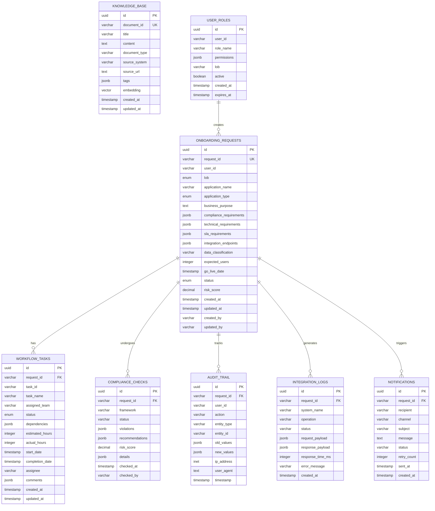

## 12. Performance & Scaling Strategy

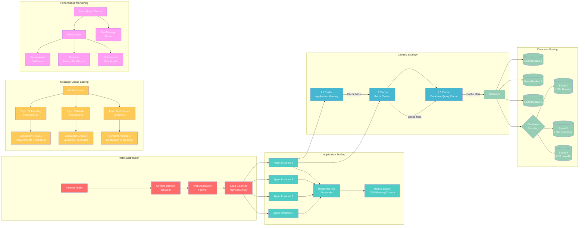

## 13. DevOps & CI/CD Pipeline

```mermaid
graph LR
    subgraph "Source Control"
        DEV[Developer<br/>Workstation] --> GIT[Git Repository<br/>GitLab/GitHub]
        GIT --> BRANCH{Branch<br/>Strategy}
        BRANCH --> FEATURE[Feature Branch]
        BRANCH --> DEVELOP[Develop Branch]
        BRANCH --> MAIN[Main Branch]
    end
    
    subgraph "Continuous Integration"
        FEATURE --> PR[Pull Request<br/>Review]
        PR --> CI_TRIGGER[CI Pipeline<br/>Trigger]
        CI_TRIGGER --> BUILD[Build & Test]
        BUILD --> LINT[Code Linting<br/>& Quality Check]
        LINT --> UNIT_TEST[Unit Tests<br/>Coverage > 80%]
        UNIT_TEST --> INTEGRATION_TEST[Integration Tests]
        INTEGRATION_TEST --> SECURITY_SCAN[Security Scanning<br/>SAST/Dependency Check]
        SECURITY_SCAN --> DOCKER_BUILD[Docker Image<br/>Build & Push]
    end
    
    subgraph "Artifact Management"
        DOCKER_BUILD --> REGISTRY[Container Registry<br/>Harbor/ECR]
        REGISTRY --> HELM_PACKAGE[Helm Chart<br/>Packaging]
        HELM_PACKAGE --> ARTIFACT_REPO[Artifact Repository<br/>Nexus/Artifactory]
    end
    
    subgraph "Continuous Deployment"
        ARTIFACT_REPO --> CD_TRIGGER[CD Pipeline<br/>Trigger]
        CD_TRIGGER --> DEV_DEPLOY[Deploy to<br/>Development]
        DEV_DEPLOY --> DEV_TESTS[Automated Tests<br/>in Dev Environment]
        DEV_TESTS --> STAGING_DEPLOY[Deploy to<br/>Staging]
        STAGING_DEPLOY --> E2E_TESTS[End-to-End<br/>Tests]
        E2E_TESTS --> PERFORMANCE_TESTS[Performance<br/>Tests]
        PERFORMANCE_TESTS --> SECURITY_TESTS[Security<br/>Tests]
        SECURITY_TESTS --> PROD_APPROVAL[Production<br/>Approval Gate]
        PROD_APPROVAL --> PROD_DEPLOY[Deploy to<br/>Production]
    end
    
    subgraph "Environment Management"
        DEV_DEPLOY --> K8S_DEV[Kubernetes<br/>Development Cluster]
        STAGING_DEPLOY --> K8S_STAGING[Kubernetes<br/>Staging Cluster]
        PROD_DEPLOY --> K8S_PROD[Kubernetes<br/>Production Cluster]
        
        K8S_DEV --> NAMESPACE_DEV[Development<br/>Namespaces]
        K8S_STAGING --> NAMESPACE_STAGING[Staging<br/>Namespaces]
        K8S_PROD --> NAMESPACE_PROD[Production<br/>Namespaces]
    end
    
    subgraph "Monitoring & Rollback"
        PROD_DEPLOY --> HEALTH_CHECK[Health Checks<br/>& Monitoring]
        HEALTH_CHECK --> METRICS_CHECK[Metrics<br/>Validation]
        METRICS_CHECK --> SUCCESS{Deployment<br/>Successful?}
        SUCCESS -->|No| ROLLBACK[Automated<br/>Rollback]
        SUCCESS -->|Yes| NOTIFY_SUCCESS[Notify Success<br/>& Update Status]
        ROLLBACK --> INVESTIGATE[Investigation<br/>& Analysis]
    end
    
    subgraph "GitOps"
        GITOPS_REPO[GitOps Repository<br/>Config Management]
        ARGO_CD[ArgoCD<br/>GitOps Controller]
        FLUX[Flux<br/>GitOps Alternative]
        
        ARTIFACT_REPO --> GITOPS_REPO
        GITOPS_REPO --> ARGO_CD
        GITOPS_REPO --> FLUX
        ARGO_CD --> K8S_PROD
        FLUX --> K8S_STAGING
    end

    classDef source fill:#e1f5fe,color:#000
    classDef ci fill:#e8f5e8,color:#000
    classDef artifact fill:#fff3e0,color:#000
    classDef cd fill:#fce4ec,color:#000
    classDef env fill:#f3e5f5,color:#000
    classDef monitor fill:#e0f2f1,color:#000
    classDef gitops fill:#fff8e1,color:#000

    class DEV,GIT,BRANCH,FEATURE,DEVELOP,MAIN source
    class PR,CI_TRIGGER,BUILD,LINT,UNIT_TEST,INTEGRATION_TEST,SECURITY_SCAN,DOCKER_BUILD ci
    class REGISTRY,HELM_PACKAGE,ARTIFACT_REPO artifact
    class CD_TRIGGER,DEV_DEPLOY,DEV_TESTS,STAGING_DEPLOY,E2E_TESTS,PERFORMANCE_TESTS,SECURITY_TESTS,PROD_APPROVAL,PROD_DEPLOY cd
    class K8S_DEV,K8S_STAGING,K8S_PROD,NAMESPACE_DEV,NAMESPACE_STAGING,NAMESPACE_PROD env
    class HEALTH_CHECK,METRICS_CHECK,SUCCESS,ROLLBACK,NOTIFY_SUCCESS,INVESTIGATE monitor
    class GITOPS_REPO,ARGO_CD,FLUX gitops
```

## 14. Cost Optimization Strategy

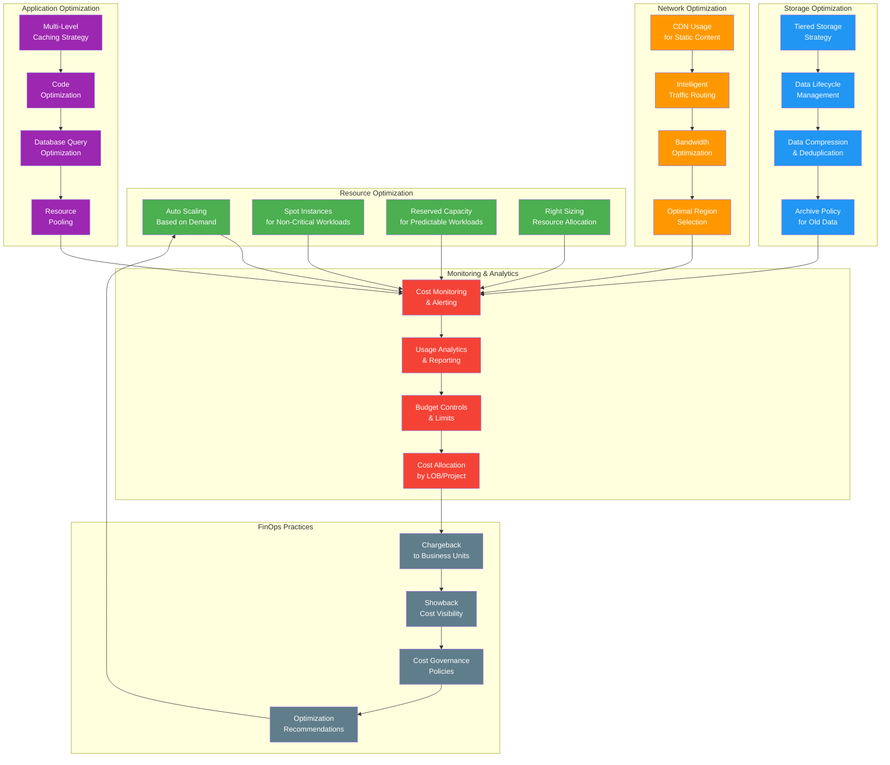

## 15. Business Impact & ROI Model

```mermaid
graph TB
    subgraph "Current State (Manual Process)"
        MANUAL_TIME[Manual Processing<br/>Time: 2-4 weeks]
        MANUAL_ERRORS[Human Errors<br/>Rate: 15-20%]
        MANUAL_COST[Processing Cost<br/>$5,000-$10,000 per app]
        MANUAL_COMPLIANCE[Compliance Issues<br/>Risk: High]
        MANUAL_BOTTLENECK[Team Bottlenecks<br/>Utilization: 60-70%]
    end
    
    subgraph "Future State (AI-Driven Process)"
        AI_TIME[AI Processing<br/>Time: 3-7 days]
        AI_ERRORS[AI Accuracy<br/>Rate: 95-98%]
        AI_COST[Processing Cost<br/>$1,500-$3,000 per app]
        AI_COMPLIANCE[Automated Compliance<br/>Risk: Low]
        AI_EFFICIENCY[Team Efficiency<br/>Utilization: 85-90%]
    end
    
    subgraph "Quantified Benefits"
        TIME_SAVING[Time Savings<br/>50-70% reduction<br/>= 1-3 weeks saved]
        COST_REDUCTION[Cost Reduction<br/>40-60% savings<br/>= $2,000-$7,000 per app]
        QUALITY_IMPROVEMENT[Quality Improvement<br/>Error reduction: 75-80%<br/>Compliance: 99%+]
        CAPACITY_INCREASE[Capacity Increase<br/>3x more applications<br/>Same team size]
        RISK_MITIGATION[Risk Mitigation<br/>Reduced compliance risk<br/>Faster remediation]
    end
    
    subgraph "Business Value Drivers"
        FASTER_TTM[Faster Time<br/>to Market<br/>Competitive Advantage]
        REDUCED_OVERHEAD[Reduced Operational<br/>Overhead<br/>Cost Optimization]
        IMPROVED_COMPLIANCE[Improved Compliance<br/>Posture<br/>Risk Reduction]
        SCALABILITY[Enhanced<br/>Scalability<br/>Growth Enablement]
        INNOVATION[Focus on<br/>Innovation<br/>Strategic Value]
    end
    
    subgraph "ROI Calculation"
        INVESTMENT[Initial Investment<br/>Development: $500K<br/>Infrastructure: $200K<br/>Training: $50K]
        ANNUAL_SAVINGS[Annual Savings<br/>Process Efficiency: $2M<br/>Compliance: $500K<br/>Productivity: $1M]
        PAYBACK[Payback Period<br/>4-6 months]
        THREE_YEAR_ROI[3-Year ROI<br/>400-500%]
    end
    
    subgraph "Key Performance Indicators"
        ONBOARDING_VOLUME[Onboarding Volume<br/>Target: 500+ apps/year<br/>Current: 150 apps/year]
        PROCESSING_TIME[Average Processing Time<br/>Target: < 5 days<br/>Current: 21 days]
        AUTOMATION_RATE[Automation Rate<br/>Target: 80%<br/>Current: 20%]
        CUSTOMER_SATISFACTION[Customer Satisfaction<br/>Target: > 90%<br/>Current: 70%]
        COMPLIANCE_SCORE[Compliance Score<br/>Target: 99%<br/>Current: 85%]
    end

    %% Current to Future State
    MANUAL_TIME --> AI_TIME
    MANUAL_ERRORS --> AI_ERRORS  
    MANUAL_COST --> AI_COST
    MANUAL_COMPLIANCE --> AI_COMPLIANCE
    MANUAL_BOTTLENECK --> AI_EFFICIENCY
    
    %% Benefits Flow
    AI_TIME --> TIME_SAVING
    AI_COST --> COST_REDUCTION
    AI_ERRORS --> QUALITY_IMPROVEMENT
    AI_EFFICIENCY --> CAPACITY_INCREASE
    AI_COMPLIANCE --> RISK_MITIGATION
    
    %% Value Drivers
    TIME_SAVING --> FASTER_TTM
    COST_REDUCTION --> REDUCED_OVERHEAD
    QUALITY_IMPROVEMENT --> IMPROVED_COMPLIANCE
    CAPACITY_INCREASE --> SCALABILITY
    RISK_MITIGATION --> INNOVATION
    
    %% ROI Components
    FASTER_TTM --> ANNUAL_SAVINGS
    REDUCED_OVERHEAD --> ANNUAL_SAVINGS# AI-Driven Onboarding Agent - Complete Architecture Diagrams
