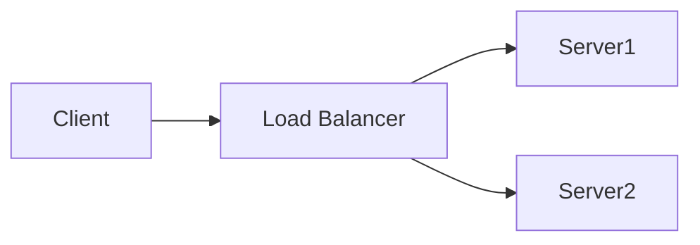
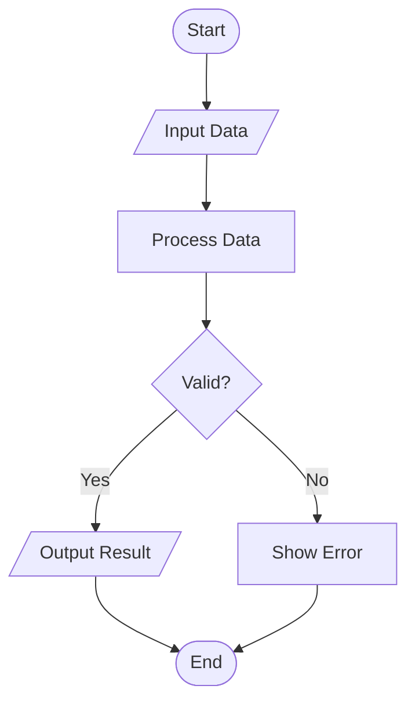
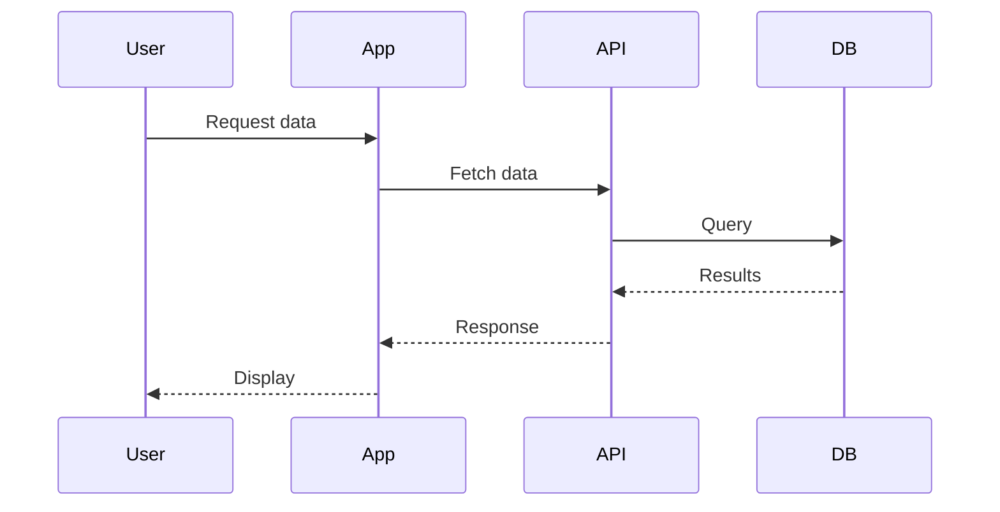
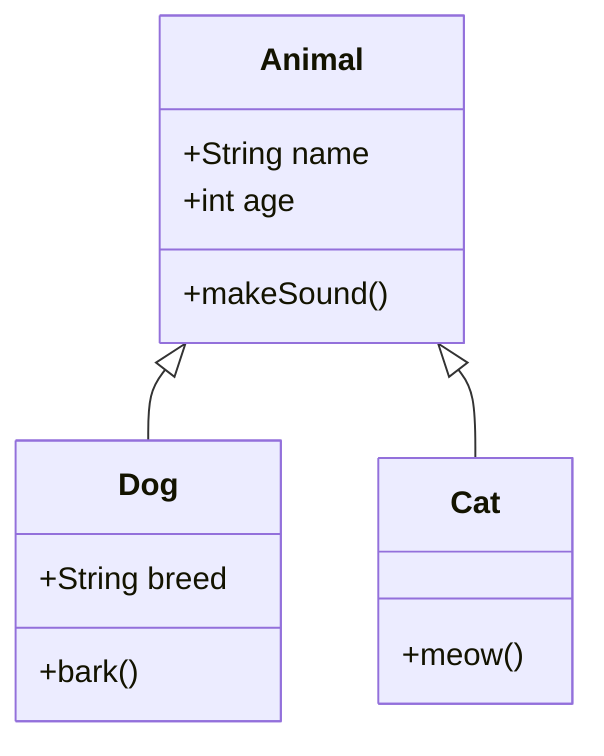

# Mermaid Diagram to SVG Conversion Guide

A comprehensive guide for converting Mermaid diagrams to SVG format using Typora and Mermaid CLI (mmdc) on macOS.

## Prerequisites

### System Requirements
- macOS (M1/M2/M4 Apple Silicon or Intel)
- Homebrew package manager
- Node.js and npm

## Installation

### 1. Install Homebrew (if not already installed)

```bash
/bin/bash -c "$(curl -fsSL https://raw.githubusercontent.com/Homebrew/install/HEAD/install.sh)"
```

### 2. Install Node.js

```bash
brew install node
```

### 3. Install Mermaid CLI

```bash
npm install -g @mermaid-js/mermaid-cli
```

Verify installation:
```bash
mmdc --version
```

### 4. Install Typora

#### Option A: Direct Download
1. Visit [typora.io](https://typora.io)
2. Download the macOS version
3. Drag to Applications folder

#### Option B: Homebrew Cask
```bash
brew install --cask typora
```

## Usage

### Method 1: Using Typora (Visual Editor)

1. **Open or Create Markdown File**
   - Launch Typora
   - Open your `.md` file or create new one

2. **Create Mermaid Diagram**
   - Type triple backticks followed by `mermaid`:
   ````markdown
   ```mermaid
   graph TD
       A[Start] --> B[Process]
       B --> C[End]
   ```
   ````

3. **Export to PDF/HTML**
   - File → Export → PDF (keeps Mermaid intact)
   - Typora renders Mermaid natively in preview

### Method 2: Using Mermaid CLI (mmdc)

#### Single Diagram Conversion

1. **Create Mermaid File** (`.mmd` extension):


Save as `diagram.mmd`

2. **Convert to SVG**:
```bash
mmdc -i diagram.mmd -o diagram.svg
```

#### Extract from Markdown

If your Mermaid diagrams are embedded in markdown:

1. **Extract Mermaid blocks** to separate `.mmd` files
2. **Convert each diagram**:
```bash
mmdc -i flowchart.mmd -o flowchart.svg
mmdc -i sequence.mmd -o sequence.svg
```

#### Batch Conversion

Create a script `convert-all.sh`:

```bash
#!/bin/bash

# Convert all .mmd files to SVG
for file in *.mmd; do
    if [ -f "$file" ]; then
        output="${file%.mmd}.svg"
        echo "Converting $file to $output..."
        mmdc -i "$file" -o "$output"
    fi
done

echo "Conversion complete!"
```

Make executable and run:
```bash
chmod +x convert-all.sh
./convert-all.sh
```

### Method 3: Combined Workflow

1. **Author in Typora** (visual editing with live preview)
2. **Export markdown** from Typora
3. **Extract Mermaid diagrams** to `.mmd` files
4. **Convert to SVG** using mmdc for embedding elsewhere

## Advanced Options

### Custom Configuration

Create `mermaid-config.json`:

```json
{
  "theme": "default",
  "themeVariables": {
    "primaryColor": "#ff6b6b",
    "primaryTextColor": "#fff",
    "primaryBorderColor": "#7C0000"
  }
}
```

Use with mmdc:
```bash
mmdc -i diagram.mmd -o diagram.svg -c mermaid-config.json
```

### Specify Background Color

```bash
mmdc -i diagram.mmd -o diagram.svg -b transparent
```

### Set Output Size

```bash
mmdc -i diagram.mmd -o diagram.svg -w 1920 -H 1080
```

## Troubleshooting

### Error: "Puppeteer not found"
```bash
npm install -g puppeteer
```

### Error: "Command not found: mmdc"
Ensure npm global bin is in PATH:
```bash
echo 'export PATH="$PATH:$(npm config get prefix)/bin"' >> ~/.zshrc
source ~/.zshrc
```

### Typora not rendering Mermaid
1. Check Preferences → Markdown → Enable Mermaid diagrams
2. Restart Typora

### Large diagrams cut off in SVG
Increase viewport size:
```bash
mmdc -i large-diagram.mmd -o output.svg -w 3000 -H 2000
```

## Example Mermaid Diagrams

### Flowchart


### Sequence Diagram


### Class Diagram


## Resources

- [Mermaid Documentation](https://mermaid.js.org/)
- [Mermaid Live Editor](https://mermaid.live)
- [Typora Documentation](https://support.typora.io/)
- [Mermaid CLI GitHub](https://github.com/mermaid-js/mermaid-cli)

## Tips

- Use Typora for quick visual editing and preview
- Use mmdc for automated conversion and CI/CD pipelines
- Keep `.mmd` files separate for version control
- SVG output is scalable and can be embedded in web pages
- Consider using PNG for raster images: `mmdc -i diagram.mmd -o diagram.png`

---

**Happy Diagramming! 📊**